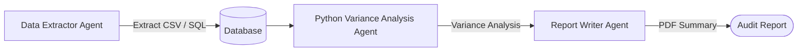

# End-to-End Automated Financial Auditing & Report Generation

Financial Auditing Agents coordinate multi-agent processes to extract transactional data, perform analysis, and synthesize audit summaries.

## Conceptual Architecture

## Detailed Explanation

- **Multi-Source Ingestion:** Pulls from APIs, SQL databases, and unstructured documents.
- **deliberative consensus:** Multi-agent chains review audit worksheets to guarantee data coherence.
- **Verifiability:** Embeds sources and mathematical proofs in final reports.

[Back to README](../README.md)
