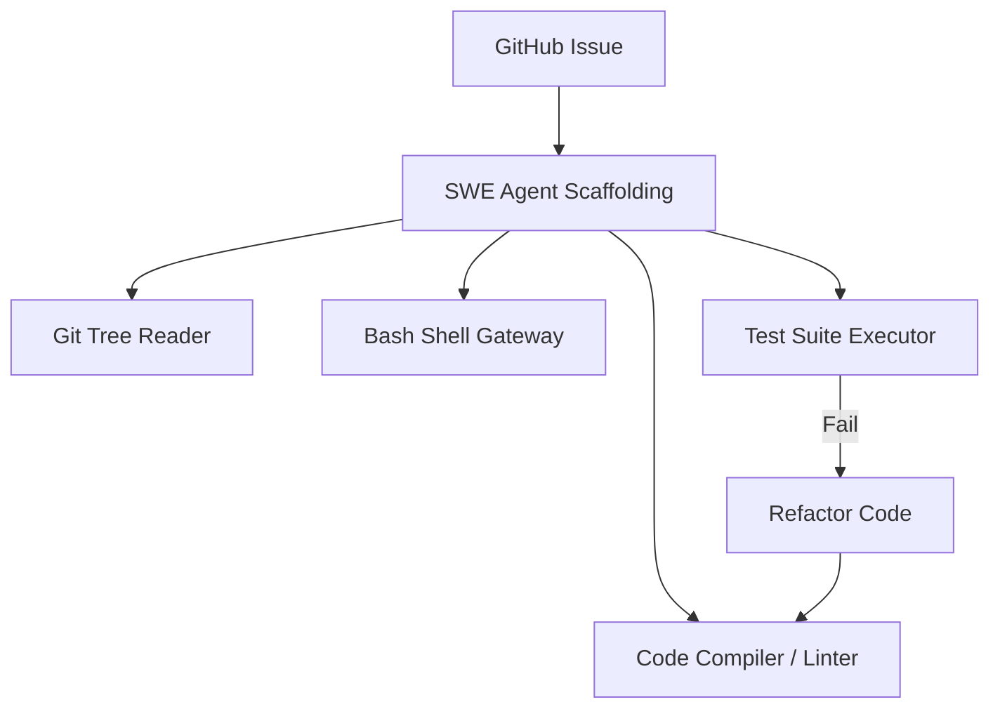

# Autonomous Enterprise Software Engineers

Autonomous SWE Agents interact directly with codebases, shells, compilers, and test suites to debug and implement features.

## Conceptual Architecture

## Detailed Explanation

- **Repository Manipulation:** Reads multi-file directories, makes edits, and creates pull requests.
- **Local Testing Loop:** Runs linting, compilation, and testing, incorporating errors directly back into the prompt context.
- **HORIZON Scaling:** Excels at resolving complex long-horizon software bugs.

[Back to README](../README.md)
