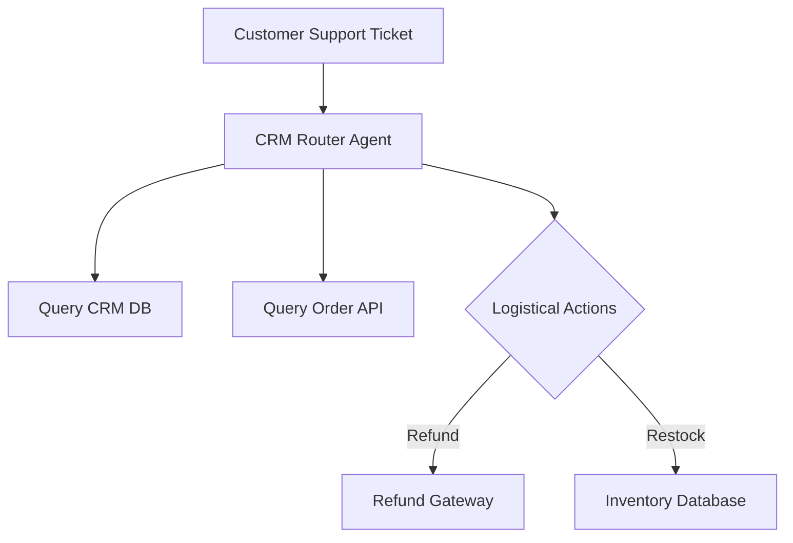

# Omni-Channel Customer Relationship Management (CRM) Agents

CRM Agents automate support tickets and logistical requests by integrating directly with order tracking, refunds, and user CRM databases.

## Conceptual Architecture

## Detailed Explanation

- **Multi-API Integration:** Hooks into inventory, billing, and profile records.
- **Policy Adherence:** Evaluates guidelines (e.g., refund eligibility) dynamically.
- **Automation:** Resolves user complaints end-to-end without manual support agent triage.

[Back to README](../README.md)
