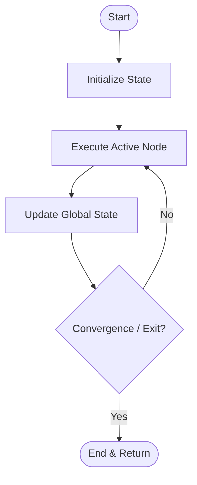

# Cyclic Stateful Graph Scaffolding

Cyclic Stateful Scaffolding maintains a mutable global state and runs agents in a feedback loop, routing actions recursively based on observations.

## Conceptual Architecture

## Detailed Explanation

- **Mutable Thread Memory:** Agents write back to database threads or memory structures.
- **Backtracking Capability:** Re-evaluates errors and loops back to previous steps for self-correction.
- **Highly Adaptive:** Best for complex reasoning tasks (e.g., debugging code).

[Back to README](../README.md)
