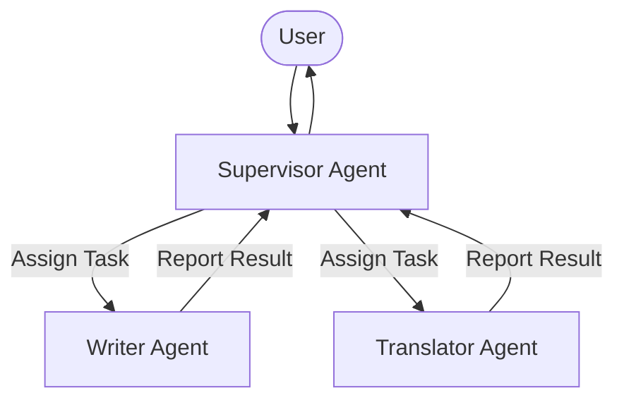

# Hierarchical Multi-Agent Orchestration

Hierarchical Orchestration introduces a central coordinator (supervisor) agent that assigns sub-tasks to specialized sub-agents.

## Conceptual Architecture

## Detailed Explanation

- **Task Delegation:** Deconstructs complex user prompts into modular actions.
- **Conflict Resolution:** The supervisor checks outputs for errors and coordinates updates.
- **Role Isolation:** Sub-agents operate with specialized system prompts and restricted tools.

[Back to README](../README.md)
