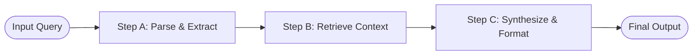

# Linear / Chain Scaffolding

Linear Scaffolding constructs a rigid pipeline of LLM calls, passing the structured output of one stage as the direct input to the next.

## Conceptual Architecture

## Detailed Explanation

- **Deterministic Paths:** No dynamic loops or adaptive backtracking.
- **Low Overhead:** Highly predictable token usage and low latency.
- **Production-Friendly:** Easily debugged and validated for compliance.

[Back to README](../README.md)
