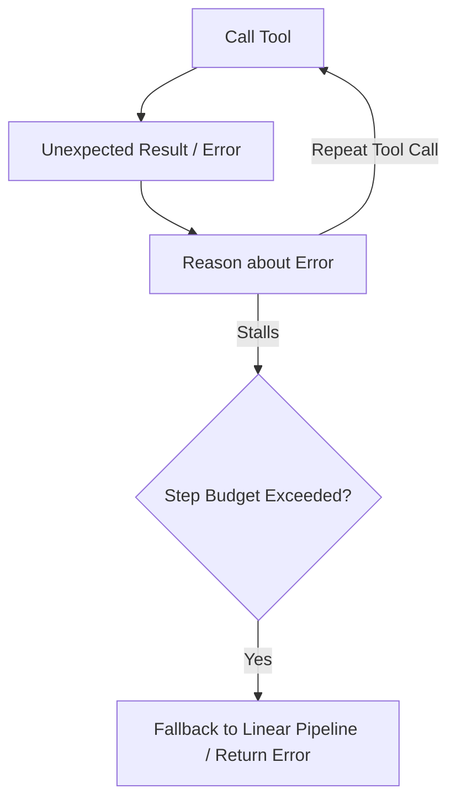

# The Agent Loop Trapping & Token Inflation Nightmare

Loop Trapping is a critical failure mode where an agent becomes stuck in a repetitive execution loop without producing progress.

## Conceptual Architecture

## Detailed Explanation

- **Infinite Loops:** Occurs when an LLM cannot handle unexpected output and retries identical payloads.
- **Token Inflation:** Rapidly drains context capacity and costs massive amounts of API budget.
- **Step Budgets:** Enforces max turn limits (e.g., max 10 steps) to terminate runaway loops.

[Back to README](../README.md)
