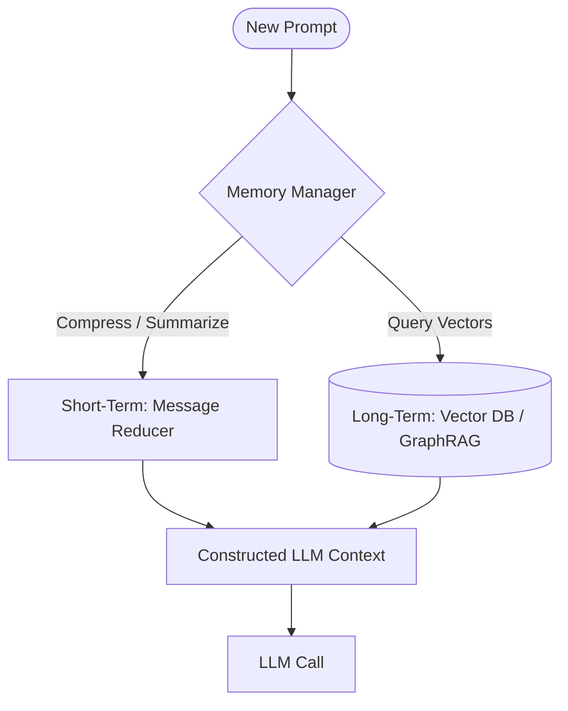

# Memory Management Engines

Memory Management Engines maintain conversational coherence by dynamically compressing context window data and storing long-term references.

## Conceptual Architecture

## Detailed Explanation

- **Message Reducers:** Dynamically summaries older messages, retaining only critical details.
- **Vector DBs & GraphRAG:** Indexes documents and user logs, pulling relevant facts via semantic search.
- **Coherence:** Prevents "forgetting" issues over long-duration interactions.

[Back to README](../README.md)
