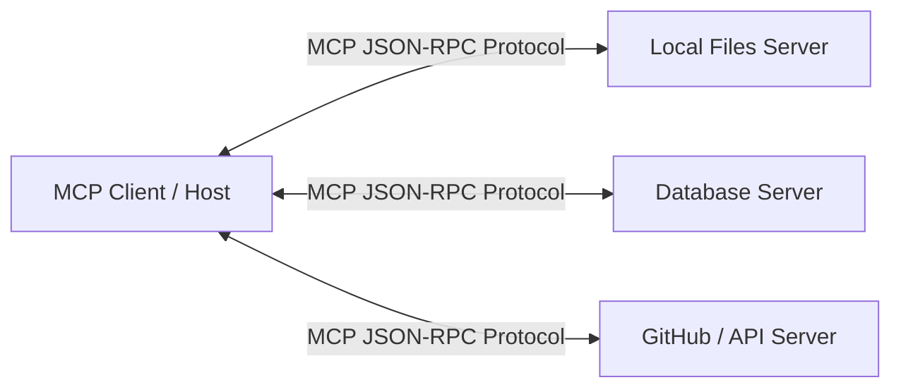

# The Standardized Model Context Protocol (MCP) Era (~2025–Present)

The Model Context Protocol (MCP) standardizes how LLM applications interact with data sources, local files, and external APIs, decoupling host clients from server-side integrations.

## Conceptual Architecture

## Detailed Explanation

- **Decoupled Architecture:** Eliminates custom tool wrappers per model, introducing a standardized protocol over JSON-RPC.
- **Universal Plugins:** Allows secure local or remote server modules to expose resources, prompts, and tools.
- **Security:** Standardizes permissions, rate-limiting, and isolation boundaries.

[Back to README](../README.md)
