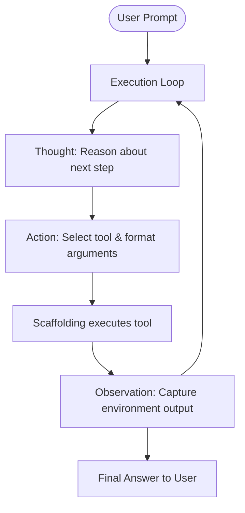

# The Linear ReAct Prompt Era (~2022–2023)

The Linear ReAct (Reasoning and Acting) Prompt Era represents the foundation of modern agentic workflows. By prompting the language model to write down its reasoning steps before calling tools, frameworks enabled multi-step problem solving.

## Conceptual Architecture

## Detailed Explanation

- **Reason + Act:** A simple loop prompting the model to alternate between reasoning chains ("Thought") and action commands ("Action").
- **Regex Extraction:** Early frameworks parsed text blocks using regex to determine which tool to call.
- **Fragility:** Minor format variations (e.g., using parentheses instead of brackets) crashed the regex parser and halted the agent.

[Back to README](../README.md)
