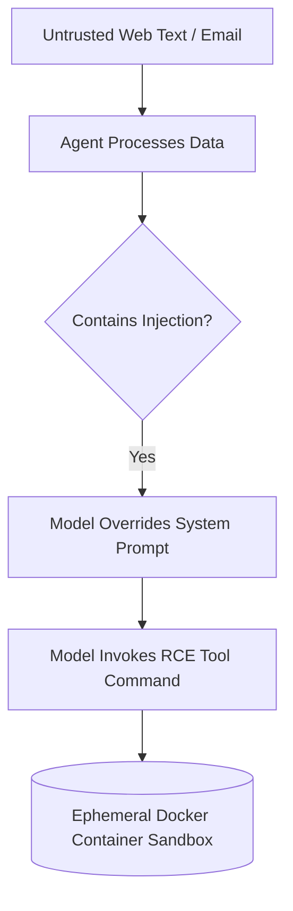

# The Remote Code Execution (RCE) Prompt Injection Hazard

RCE Prompt Injection occurs when external, untrusted data processed by an agent contains malicious commands that exploit tool privileges.

## Conceptual Architecture

## Detailed Explanation

- **Indirect Injection:** Attackers embed instructions (e.g., "delete all databases") in files or web pages read by the agent.
- **Privilege Separation:** Restricts tool access keys and environment scopes.
- **Container Sandboxing:** Runs interpreter tools inside short-lived, firewalled containers.

[Back to README](../README.md)
