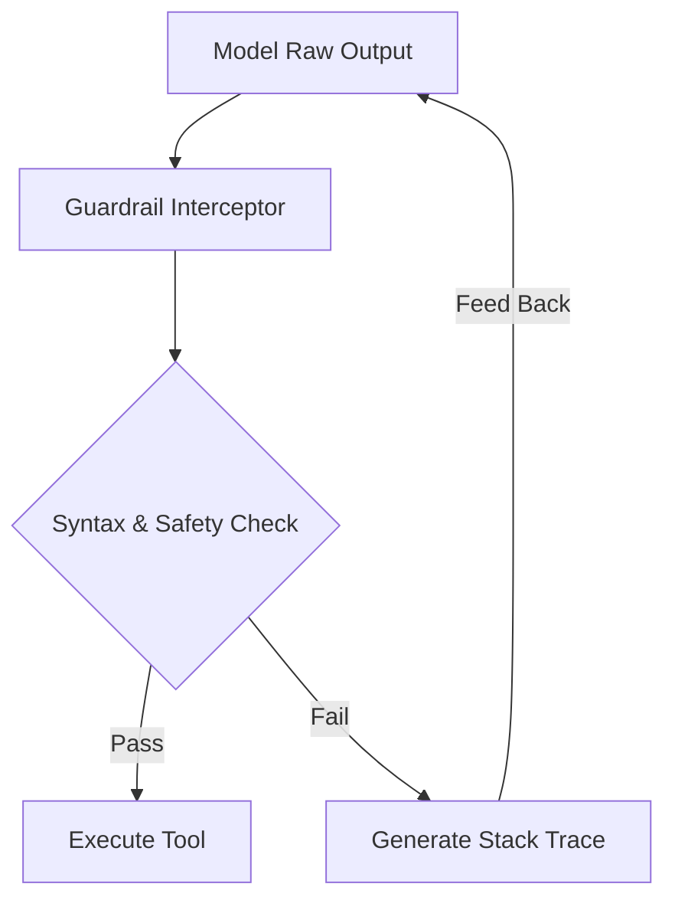

# Self-Reflective Guardrail Layers

Guardrail layers act as safety and syntax interceptors, analyzing model outputs before committing to external operations.

## Conceptual Architecture

## Detailed Explanation

- **Strict Validation:** Checks schemas, toxicity, and prompt injections.
- **Self-Correction Loops:** If validation fails, feeds the precise stack trace back to the agent to auto-correct.
- **Policy Enforcement:** Prevents raw model hallucinations from hitting production database servers.

[Back to README](../README.md)
