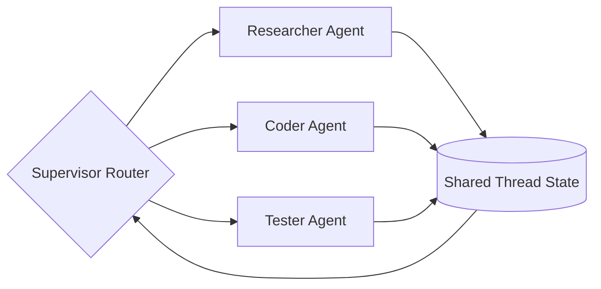

# The Stateful Directed Graph & Multi-Agent Era (~2023–2025)

As agents scaled, linear prompt chains failed. Developers turned to Directed Acyclic Graphs (DAGs) and state machines to govern paths and route messages across multiple specialized agents.

## Conceptual Architecture

## Detailed Explanation

- **Explicit Routing:** State machines route tasks dynamically based on intermediate tool outputs or evaluation metrics.
- **Multi-Agent Collaborative Networks:** Instead of one massive prompt, specialized sub-agents focus on core subtasks (e.g., research, coding, testing) and collaborate via shared thread memory.
- **Improved Reliability:** Reduces state-space explosion and controls context usage.

[Back to README](../README.md)
