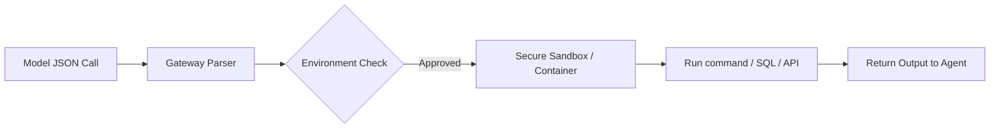

# Tool Execution & Sandbox Gateways

Tool Gateways parse the model's structured payload (e.g., JSON calls) and safely execute actions across environment boundaries.

## Conceptual Architecture

## Detailed Explanation

- **JSON Validation:** Validates model-generated parameters against schemas.
- **Environment Isolation:** Executes commands inside sandboxed environments (Docker, gVisor) to prevent host infection.
- **Execution Logging:** Records tool histories for audit trails.

[Back to README](../README.md)
